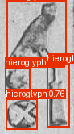

# Hieroglyph-Translator
This research-driven project aims to translate ancient Egyptian hieroglyphs into English using a deep learning pipeline. The system combines YOLOv8 for object detection, a custom-trained CNN for classifying the hieroglyphs, and LangChain with LLM to generate meaningful English translations.

  
  

The decision to use a detection-classification approach was made because there is no publicly available dataset for hieroglyphs that would allow for a sequence-to-sequence model. Although I initially considered using a sequence-to-sequence method to generate sentences directly, the lack of sufficient annotated data for this type of task made it an impractical solution.

# Dataset
The original dataset of individual hieroglyph images used for this project was sourced from [here](https://github.com/morrisfranken/glyphreader). It is compiled by Morris Franken, each hieroglyph is manually annotated and labelled according the Gardiner Sign List.

Since the dataset lacked bounding box annotations required for YOLOv8, all images were manually annotated using Roboflow to define regions of interest for detection tasks.

# Future Work

The CNN model showed some promising results and was able to classify the hieroglyphs fairly well. However, the limited amount of data available for such a complex task impacted the performance of the YOLO model. Although YOLO managed to detect the regions of interest, the lack of enough training data resulted in less accurate detections, making it harder for the model to generalize across different images. As a result, the detection quality wasn’t as high as expected.

The pre-trained GPT model used in this project was not able to generate sentences perfectly, as it had not been custom trained for the specific requirements of our project. While it provided useful translations, the results could have been more accurate and contextually appropriate with further fine-tuning on a dataset tailored to hieroglyphs and their meanings.

## Ongoing Work and Future Directions
Dataset Expansion: The current dataset is limited, and adding more hieroglyph images with accurate annotations would greatly improve both detection and classification performance.

Fine-Tuning GPT: The GPT model used here wasn't tailored to hieroglyphs. Future work could involve fine-tuning it with a specialized dataset to improve translation accuracy.

Multimodal Models: Combining visual and textual data could enhance translation accuracy by understanding the context better, leading to more reliable translations.
